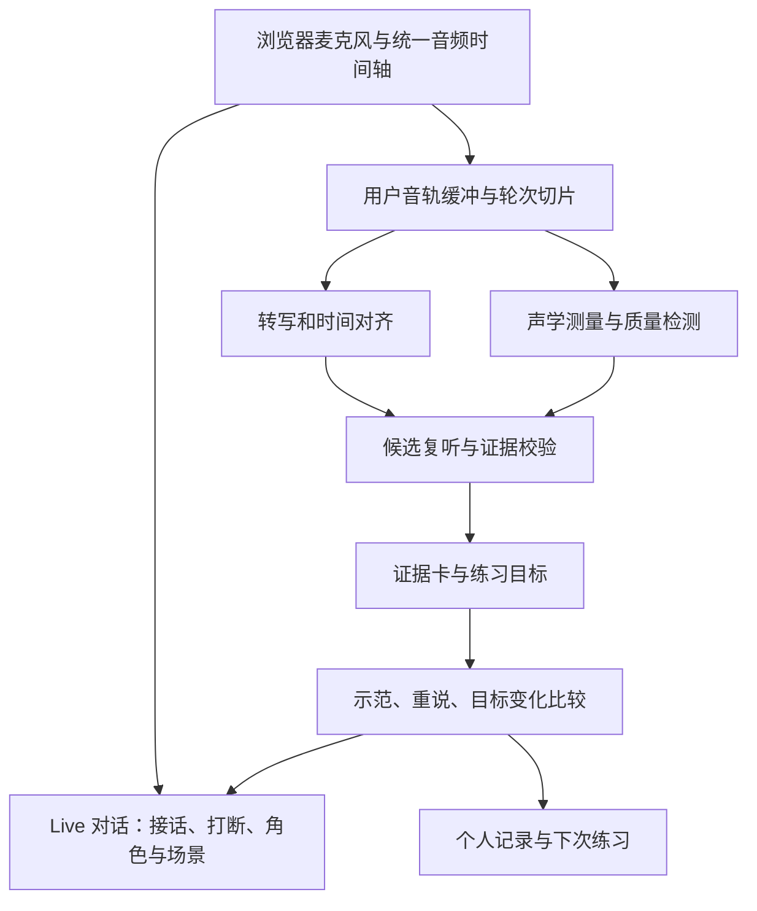

# Oralign 产品升级调研与方案

调研日期：2026-09-22。依据当前仓库、官方产品及技术文档、相关论文。竞品描述是公开能力核查，没有做付费实测；下文的体验、时延、质量门槛及排期均为建议，尚未验证。

**建议将 Oralign 升级为面向真实交流的个人口语教练：通过 Live 对话发现问题，用可回听的声音证据解释问题，在短练习和新对话中验证改变，并积累个人训练路径。**

沿用当前中文母语、英语 B1–C1 成人的用户假设，覆盖工作与日常生活。成熟度来自连续的用户旅程、可信的反馈和可靠的交互。Live、证据和成长记录应该在同一版产品中相互支撑。当前单段练习适合成为其中的精练环节。

**1. 当前基础与需要改变的产品决策**

阅读了 README、PRD、架构文档及核心分析代码，得到以下现状。

| 方面 | 已有基础 | 下一版需要补齐 |
|---|---|---|
| 输入 | 单人录音、上传、局部重说 | 连续语音对话、轮次管理、打断、恢复 |
| 分析 | Scribe 词时间线 + Gemini 原音和文本联合分析 | 独立的声学测量、候选复核、跨轮上下文 |
| 证据 | 原音裁切、定位、回听 | 测量值与来源、质量限制、证据和解释分离 |
| 示范 | 动作规划、TTS、独立调用检查 | 嵌入现场教学，使用前说明它展示哪个动作 |
| 练习结果 | 用户自主比较原音和重说 | 针对同一目标的变化检测、带回新问题验证 |
| 长期体验 | 当前会话内存 | 历史、个人高频模式、复习计划、数据控制 |
| 交付能力 | 本地单用户原型 | 身份、配额、恢复、成本监控及删除流程 |

一个具体差距：`workbench/lib/transcript-timing.ts` 的 `transcriptGaps` 计算的是 ASR 词边界间隔，代码也明确它不是声学静音检测。`evidence_sources: audio` 则是模型的来源声明，不能独立证明其声音判断正确。调研时尚无 Live 通道；用户重说的自动变化验证也未实现。

来源：[单段练习说明](./workbench/README.md)、[架构与限制](./workbench/docs/architecture.md)、[词时间线实现](./workbench/lib/transcript-timing.ts)、[分析提示](./workbench/lib/prompts.ts)。

建议修订的方向：让 Live 成为主入口之一；“一次练一个动作”保留在局部教学中；会话可以发现多个候选，但按需要逐个呈现；历史和迁移练习进入首个完整版本。

**2. 外部调研告诉我们什么**

| 产品或研究 | 查到的公开能力/结论 | 对 Oralign 的启发 |
|---|---|---|
| Speak | 官网介绍口语练习、实时反馈与 AI 对话；Tutor Lessons 帮助页描述可追问、调节节奏的教学。v2 的相关能力仍有封闭测试及课程限制 | 将解释、练习与交流连在一起；不能仅提供一张分析结果页 |
| ELSA Speech Analyzer | 提供自由表达分析，涵盖发音、语调、流利度、语法、词汇以及回顾流程 | 多维报告已有竞争；我们需要把某条判断与可听证据、行动、复测直接关联 |
| Loora | 围绕日常及工作场景开展对话，公开强调即时反馈和个性化交流 | Live 和场景练习已是用户会比较的基础能力 |
| 2026 年实时语音模型研究 | 在特定语调、情绪与决策任务中，发现语音模型的判断仍可能受文字内容主导 | 需要验证模型是否实际利用目标声音线索，不能从“支持音频输入”推导诊断可靠 |
| L2-Arctic-plus 研究 | 以发音错误解释与可执行建议评估音频语言模型，报告专门训练带来的改进 | 发音诊断、教学建议需要专门数据和评估，通用对话体验不能替代它们 |

竞品资料没有证明 Oralign 能形成独有能力；“证据到迁移的闭环”是建议验证的差异化假设。上述研究也不是所有新模型、所有口语任务的通用结论。

来源：[Speak](https://www.speak.com/)、[Tutor Lessons](https://help.speak.com/en/articles/11966855-what-are-tutor-lessons)、[ELSA Speech Analyzer](https://speechanalyzer.elsaspeak.com/)、[Loora](https://www.loora.com/)、[Real-Time Voice AI Hears but Does Not Listen，预印本](https://arxiv.org/abs/2606.26083)、[Unlocking Large Audio-Language Models for Interactive Language Learning](https://arxiv.org/abs/2601.14744)。

**3. 用户应该得到怎样的完整产品**

建议提供五个相连的能力，导航保持为“练习、回顾、成长”三个入口。

| 能力 | 用户价值 | 关键交互 |
|---|---|---|
| Live 对话 | 随时练习真实交流、组织回答、应对追问 | 自由聊天或选择场景；随时打断、暂停、求助；AI 记住当前情境 |
| 场景排练 | 为下一次实际沟通做准备 | 工作解释、面试追问、生活协商三类起步；调整角色、难度和沟通目标 |
| 证据回顾 | 理解系统为什么提出建议 | 点一下播放原音；突出相关停顿/词语/音高片段；可展开上下文与判断限制 |
| 针对性训练 | 把建议变成自己做得到的动作 | 原音→示范→自己说→比较→继续原对话；支持原词句和自己的措辞 |
| 个人成长 | 知道自己反复遇到什么、下次练什么 | 保存用户选择的片段和目标；跨会话观察；安排在不同场景中再次使用 |

首页主动作建议是“开始对话”，旁边保留“排练一件事”和“分析一段录音”。用户不必先填写能力表、选择术语或知道自己的问题。

场景需要定义角色、双方已知信息、沟通目标、可变化的追问，而不是换一个开场提示词。例如生活协商中，用户需要解释需求、理解限制、提出备选方案；会话结束可以回顾目标是否在模拟中达成。AI 的模拟理解和追问只代表本次系统行为，不能充当真实听者理解难度的证明。

**一段建议体验（示例，不是真实测试结果）**

用户选择“解释项目延期”。AI 扮演同事，追问“为什么不能周五交付？”用户连续回答。系统在一轮结束后留下一个小标记：“有一处停顿可以回听”，对话继续。

用户点标记，教练播放 `We need to / confirm the date` 附近的原音。证据显示 `to` 与 `confirm` 之间存在约 0.7 秒的语音活动间隔；模型结合上下文解释这可能让短语被听成两段。卡片把测量观察和影响假设分别写清楚。

用户听到只演示该动作的参考语音，重说一遍。系统确认内容可比较后，显示间隔缩短及可回听对照；不会据此宣称整体流利度或真人理解已经提高。接着 AI 回到同事角色，用新的问题让用户再次组织回答。隔天换成预约协商，检查类似结构能否自然连起来。

证据卡同时保留“这次表达有效”的片段，帮助用户知道哪些做法值得保持；只在有依据时给出。

**4. 实时反馈要按时机分层**

| 时机 | 适合反馈什么 | 默认呈现 |
|---|---|---|
| 正在说话 | 麦克风状态、削波、音量过低、连接状态；专项练习中可显示目标节奏 | 极轻的视觉状态，避免挤占表达注意力 |
| 一个自然轮次结束 | 已经核实的一条局部观察；可选措辞提示 | 小卡片或时间点标记，对话不等待分析 |
| 用户请求教学/阶段暂停 | 原音、解释、动作示范、短练习 | 明确进入教练状态，练完可返回刚才的场景 |
| 会话结束 | 最值得回顾的 2–3 个片段、一个后续目标 | 证据摘要与下次练习入口 |

允许用户选择“先聊完再反馈”或“边聊边练”。AI 作为交流对象时自然回应；进入教学时明确切换，避免在扮演面试官时突然逐句纠错。

外语使用者会在句中思考。轮次结束不能只由一个固定静音阈值决定：结合语音活动、句子是否完整、个人停顿习惯，并提供“我还没说完”和按住说话的后备方式。用户插话后应尽快停止 AI 播放，移除尚未听到的回复内容，避免后续对话假定用户已经听过它。

建议的初始性能预算：从确认用户结束发言到 AI 首段可听声音，P50 ≤0.8 秒、P95 ≤1.8 秒；打断后停止播放 P95 ≤300 毫秒；轮次确定后 2–5 秒内给出可用证据卡。另行记录从用户最后一帧语音到回复的时间和错误抢话率，防止通过过早切断用户“优化”延迟。数值是待实测目标；超时的分析留到回顾页，不阻塞接话。

**5. 怎样让语音特征有真正的证据**

每条声音反馈需要四层信息：可播放原音、实际测得的声学现象、上下文中的解释、能复测的练习目标。技术信号不自动等于表达错误。

| 特征 | 证据与测量路线 | 用户能看到什么 | 判断边界与优先级 |
|---|---|---|---|
| 停顿与意群 | 波形/能量 + VAD 语音活动边界 + 词对齐 + 句法语境 | 原音上的间隔区间和大致时长 | VAD 漏检、轻声和塞音闭塞可能混淆；长停顿不必然有害。第一批上线 |
| 局部速度、节奏 | 可靠转写下的词速；发声区间、停顿分布、连续表达长度；明确统计口径 | 句中哪里突然加快、哪一段连续性改变 | ASR 漏词影响词速；不奖励单纯更快。第一批上线 |
| 关键词突出程度 | F0、相对能量、时长及词/音节对齐；结合句子焦点 | 对齐原音的轮廓，比较目标词与周围词 | 单一音高峰不能证明重音；需要说话者内归一化和质量门槛。第二批 |
| 句末语调 | 有声帧的 F0 走势及句末位置，复听核对 | 原音与重说的升降趋势 | 疑问不总是上升；无声段不连成虚假曲线；不凭曲线判礼貌或自信。第二批 |
| 个别音素/词混淆 | 专用发音评估或经验证的音素模型 + 正确文本/意图核实 + 原音 | 具体词片段、可能混淆、针对性练习 | 转写错误不等于发音错误；对齐到预期音素不证明实际发出了该音。先在短句精练中试验 |
| 填充词、重启、自我修正 | 尽量保留不流利现象的 ASR + 原音复核 | 某次重复或修正及上下文 | 不机械删除自然话语标记，不将所有修正视为问题 |
| 用词、指代、组织 | 转写和会话语境，必要时回到音频核实内容 | 原句和具体含义差异 | 清楚标为内容反馈，不包装成声学发现 |

声学分析可以采用 Praat/Parselmouth 提取音高、强度等信号，Silero VAD 作为语音活动检测候选。具体阈值和性能要在目标用户的设备、音量与口音上校准。两者提供测量能力，不提供“这会让听者费力”的现成结论。[Praat](https://praat.org/manual/Intro.html)、[Parselmouth](https://parselmouth.readthedocs.io/en/stable/)、[Silero VAD](https://github.com/snakers4/silero-vad)。

**证据数据契约建议**

- 定位：`session_id`、`turn_id`、`audio_id`、`start_ms/end_ms`、上下文范围；统一映射到客户端录音时间轴。
- 原始观察：`feature_type`、测量值、单位、窗口、算法和版本；不得把模型生成的数字写成测量结果。
- 质量：音频条件、对齐质量、音高有效帧比例、处理链；内部可信度必须先校准，用户端用具体限制说明。
- 解释：观察事实、可能的交流影响、上下文依赖，彼此分开。
- 练习：稳定的 `target_id`、单一动作、可比较范围和内容保持状态。
- 生命周期：候选、已核实、撤回/失效；绑定转写版本。旧轮次的迟到结果不得挂到新句子上。

原音时间、测量和片段必须可追溯。提示词里加“请基于音频”或调用第二个相同模型都不足以验证独立性。反馈来源冲突时，保留回听并降低或取消诊断。

**6. 推荐技术架构：对话路径与证据路径并行**

对话模型负责交流；证据路径负责产生经过校验的反馈。教学策略层决定何时呈现和是否进入精练，不要求拆成多个 Agent。

| 层 | 推荐起点 | 选择理由及待验证事项 |
|---|---|---|
| Live | 先做 Gemini Live 与 OpenAI Realtime 的小型同场景比较；默认从现有 Gemini 体系开始 | 保留当前接入经验；按二语停顿容忍、打断、上下文恢复、时延和实际成本选型，不按演示流畅度决定 |
| 转写/对齐 | 复用 Scribe；试验实时提交结果的词时间戳 | 字幕临时结果只展示，不立即判错；最终转写仍可能修订，需稳定轮次和版本 |
| 声学服务 | 增加独立 Python 分析进程/服务，封装 Praat/Parselmouth、VAD | 将可重复测量与模型解释分开，支持离线回归 |
| 候选解释 | 复用 Gemini Coach，增加先听候选、定位复听和证据校验 | 不把纯文字润色当作声音能力；一条无效候选不应使整次会话失败 |
| 发音专用分析 | Azure Pronunciation Assessment 作为短句精练的对照候选 | 能提供音素等粒度结果；其评分目标与 Oralign 的交流目标不同，需要校准后转成证据，不直接搬总分 |
| 示范 | 复用现有动作示范服务；常用且已核实的片段可缓存 | 控制与目标无关的改动；生成和复核失败时保留动作解释与原音 |
| 应用与数据 | 保留 Next.js，新增 Session/Turn/Evidence/Attempt/SkillObservation；持久数据使用数据库，音频独立对象存储 | 可选保存、删除、历史与指标成为完整产品基础 |

官方核查：Gemini Live 支持连续音频、打断、输入/输出转写，原生通道为 WebSocket，文档建议浏览器使用短期令牌。OpenAI Realtime 支持 WebRTC/WebSocket，WebRTC 路径可处理打断时未播放内容的截断。ElevenLabs 实时转写可在 committed 结果中提供词级时间戳。Azure 支持有稿/无稿评估，文档说明韵律评估限 `en-US`，不能据此承诺跨语言一致能力。[Gemini Live](https://ai.google.dev/gemini-api/docs/live-api)、[OpenAI Realtime](https://developers.openai.com/api/docs/guides/realtime-conversations)、[Scribe 实时转写](https://elevenlabs.io/docs/eleven-api/guides/how-to/speech-to-text/realtime/transcripts-and-commit-strategies)、[Azure 发音评估](https://learn.microsoft.com/en-us/azure/ai-services/speech-service/how-to-pronunciation-assessment)。

需要在实现中明确的细节：

- 用户与 AI 音轨分开；记录回声消除、降噪、自动增益等处理情况。不要把 AI 声音或回声当成用户特征，也不宣称浏览器录音是未经处理的实验室原声。
- 采样率转换、切片偏移、播放时间与服务端时间戳统一；重连后以轮次/事件 ID 去重。
- 不用当前短请求端点承担长期音频代理；直连使用短期凭据，如需中继则使用支持长连接的服务。
- 声学分析异步执行；可取消、限并发、背压；连续流中保留合理上下文，不在每个小音频块上调用完整 Coach。
- Live 字幕可服务对话；只有需要独立词定位时才启用第二条转写链，或对选中片段补对齐。实测后决定，避免无条件重复处理整场音频。
- 先用受控试验比较供应商，生产默认一路。永久 API 密钥留在服务端。

**7. 如何证明系统真的识别了声音**

建议从第一周建立轻量验证集，同时开发 Live，不将完整产品无限后移。

第一批收集约 100–150 个经同意的短片段，覆盖不同水平、设备、说话速度；包括自然且清楚的口音、异常切分、句中思考、数字/否定、低音量、噪声和转写错误。按说话者隔离开发和留出测试集，避免同一人的相似句子两边出现。样本量用于早期工程筛查，不能证明面向总体的学习效果。

| 验证问题 | 试验 | 通过的含义 |
|---|---|---|
| 对声音变化敏感吗？ | 同一文本、同一说话者录制不同停顿/重音版本；由听者确认只改变预期特征 | 特征反馈跟随目标声音变化，定位到正确范围 |
| 是否被文字带偏？ | 保持音频，提供正确、错误或不提供转写；另测仅文本基线 | 声学测量稳定，模型在矛盾时复核或弃权，而非编出不存在的声音 |
| 是否把质量差误判为口语差？ | 同一句加入噪声、改变音量和设备条件 | 质量不足时降低覆盖率，不大量新增发音错误 |
| 重说比较是否可信？ | A/B 顺序交换、同音频重复、改变内容或录音条件 | 同音频不凭空进步；内容不可比时不强判；交换顺序后结论一致 |
| 是否帮助交流？ | 目标听者在随机顺序下听原版/重说，复述关键信息、评估费力程度 | 只对听者结果有改善的任务作相应主张；与声学改变分开报告 |

“同文本换声音”需要自然录制样本为主；人工剪辑或改调样本只作为补充，避免模型靠编辑痕迹过关。发音专家核对语音现象，目标交流对象核对可理解度，两种判断不混用。

初始发布门槛建议：在留出集上，展示给用户的声音观察至少 90% 经人工回听支持；同时报告建议覆盖率、漏检和各类样本分布，防止靠全部弃权过关。对没有目标问题的样本，单独检查误报；能力不达标就关闭对应诊断，不影响已稳定的 Live 与其他反馈。早期阈值需结合误报代价和样本置信范围调整。

再用 10–20 名目标用户完成两周试用，观察能否在无引导下完成“对话→回听→练习→返回对话”，以及是否愿意再次使用。这里验证可用性和使用动机；长期迁移需要更长周期与新任务评估。

**8. 从完整 Alpha 到成熟产品的排期**

以下按两名能持续投入的工程开发者、兼职产品/设计支持和可安排的语音专家评审估算，约 8–10 周形成完整封闭 Alpha；这是范围预算，不是已有团队或交付承诺。单人推进可先按 12–16 周重排，首周技术比较后再校准。

| 阶段 | 可体验交付 | 重点验收 |
|---|---|---|
| 第 1–2 周 | Live 对话骨架，三类场景，打断/暂停/字幕，保留用户音轨；第一批验证样本 | 用户能连续完成一次会话；记录抢话、延迟、恢复和成本 |
| 第 3–4 周 | 停顿/节奏证据卡、原音导航、轮后反馈、边聊边练与结束后反馈 | 音频定位正确；测量可复现；反馈不阻塞对话；无效单条能降级 |
| 第 5–6 周 | 同目标示范、重说变化检测、返回原场景、换问法复测；账号与历史 | 完成全旅程；比较守住原意；没有证据时不产生改善结论 |
| 第 7–8 周 | 个人目标、复习队列、跨会话证据、保存/删除、配额、失败恢复；用户试用 | 能继续上次练习；用户理解数据控制；弱网/拒绝麦克风等状态可用 |
| 第 9–10 周 | 修复试用问题；符合质量门槛的重音/语调或短句发音能力进入试用 | 分能力报告质量、覆盖率、体验与成本；未达标能力保持实验状态 |

第一版完整 Alpha 至少包括 Live、场景、证据、精练、历史和恢复。发音模型自训练、多人会议插件、团队管理、更多语言可在此后扩展；它们不应挤占主要旅程。

**9. 长期训练与产品衡量**

个人档案记录“在什么任务中出现过什么现象、做过什么练习、有何证据”，而不是一次录音就给用户贴“重音差”的永久标签。建议跨多个不同会话反复观察后才提出高频模式；用户能查看出处、纠正和删除。数据少时明确显示样本不足。

推荐每次只有一个主要训练目标，能力覆盖可以扩展到表达组织、对话修复、轮次互动和语用。复习依据上次表现与用户目标安排；一次跟读成功仅记为本次尝试成功，之后用无文字提示、新问题、新场景检查迁移。

北极星指标建议为：每周完成一次“有证据的练习，并在后续新对话中再次尝试目标”的活跃用户数。另行衡量：

- 体验：首次会话完成、被错误打断、证据回听、进入精练、返回对话和次周复用。
- 可信度：分特征的定位与观察正确率、误报、覆盖率、弃权、用户提出异议后的复核结果。
- 学习：同目标变化、新任务中使用、延迟复测、抽样真实听者结果；不以聊天时长或供应商总分替代。
- 交付：连接成功、P50/P95 延迟、断线恢复、每成功会话和每完成练习的成本。

成本按真实用量记录：Live 音频输入/输出及上下文、额外转写、声学服务、候选复核、示范生成与存储/流量。先测 10 分钟会话在不同用户/AI 发言比例下的实际账单，不在尚未核验套餐与调用量时给出伪精确单价。限制无效重试和无用户语音的空闲连接；参考语音按需生成，避免为了便宜而减少用户需要的交流。

持久化改变了当前“会话结束即释放”的体验，需要明确的新设置：是否保存练习录音、保存多久、是否仅保存用户选中的片段、删除会话时处理哪些派生数据。质量改进样本采用单独选择，普通使用不默认成为评测数据。删除流程覆盖对象存储、数据库及可控的派生缓存；供应商侧保留按实际设置和合同如实说明。

**建议优先执行的决策**

采用“Live 对话 + 证据回顾 + 目标训练 + 个人成长”的完整方向。最近一轮开发先做可连续交谈的场景骨架，并同步建立停顿/节奏的真实测量与验证；随后把现有重说能力接回对话，形成第一次完整体验。主要技术投入从继续堆叠分析提示词，转向音频时间轴、证据契约、异步分析、变化验证和会话状态管理。

本次产出为方案和资料核查；没有调用收费语音 API、完成用户研究或验证上述性能目标。现有 PRD 和应用代码未改动。
